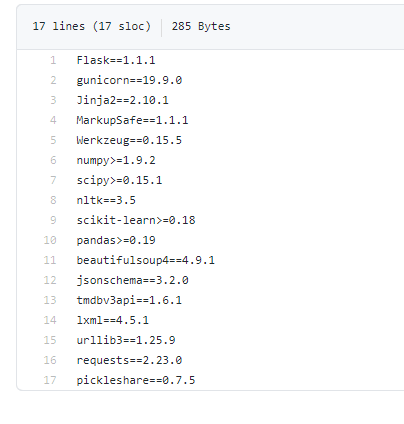

# Airbnb Price Estimator: Data Science end to end Project Overview

1 - Carried out EDA on Airbnb open data set across NYC and finding key insights.

2.0 - Optimized Linear, Lasso, Decision Tree and Random Forest Regressors using GridsearchCV to reach the best model.

2.1 - Built a client facing API using flask and deploy the model on Heroku. 

# Code and Resources Used

**Python Version**: 3.7

**Packages**: pandas, numpy, sklearn, matplotlib, seaborn, json, pickle

**Data Resource**: https://www.kaggle.com/dgomonov/new-york-city-airbnb-open-data

 # [EDA](https://github.com/Jaspreetsm21/airbnb_prices__ML/blob/master/Cleaning%20and%20EDA.ipynb) 
  
  
  
  
  
 
 ## Insight 
Private Room and Home/apt are the most popular across the neighbourhoods.

Manhattan has the most listing on Airbnb

60% of listings are Entire Home/apt in Manhattan whereas in Bronx, Brooklyn, and Queens 50% of the listings are private homes.This suggests more houses are vacant in manhattan compare to other areas.

Prices in Manhattan is clearly more expensive and It has a huge demand

It is interesting to see private and shared rooms have similar prices for their particular areas (Staten Island, Queens, and the Bronx). This could also be biased as there are fewer shared listing across neighbourhoods.

The number of days when the listing is available for booking is much lower for Manhattan then Staten Island. This could suggest in Manhattan people are rent out the entire home for half of the year.

Home and Private rooms tend to get the most reviews and the majority of these rooms are based in Manhattan and Queens.

# Model 
 First, I transformed the categorical variables into dummy variables. I also split the data into train and test sets with a test size of 35%.

I tried four different models and evaluated them using Mean Absolute Error. I chose MAE because it is relatively easy to interpret and outliers aren’t particularly bad in for this type of model.

I tried four different models:

Lasso – Baseline for the model

Decision Tree and Kneighborsregressor

Random Forest – Again, with the sparsity associated with the data, I thought that this would be a good fit.

# Evaluation

The Random Forest model far outperformed the other approaches on the test and validation sets.

Random Forest: MAE = 32

Decision Tree: MAE = 47

Lasso Regression: MAE = 32

 # Production 
 In this step, I built a client facing API endpoint and model was hosted on Heroku.
 
## Setup for Deployment of the model on Heroku:

1.Procfile

[2. App](https://github.com/Jaspreetsm21/airbnb_prices__ML/blob/master/app.py)

python script for deploying the model using flask.

3.requirements

